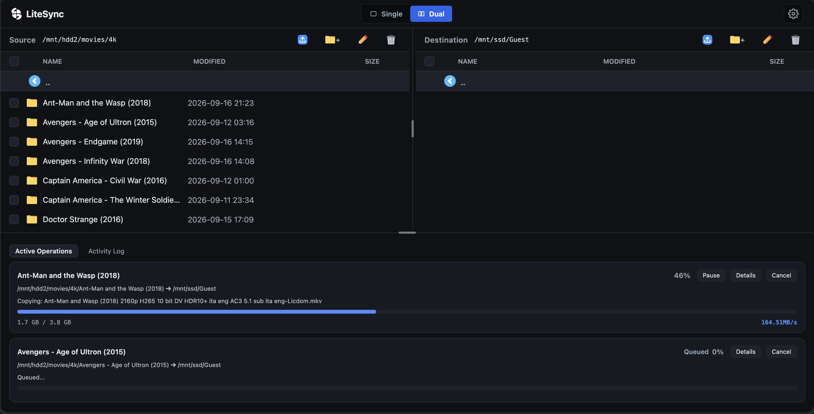
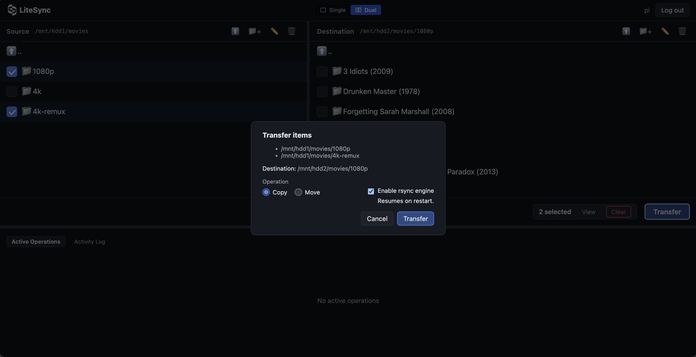

<div align="center">

  <p>
    <a href="https://www.python.org/"></a>
    <a href="https://fastapi.tiangolo.com/"></a>
    <a href="#"></a>
    <a href="#"></a>
    <a href="LICENSE"></a>
  </p>

  <picture>
    <source media="(prefers-color-scheme: dark)" srcset="docs/logo_dark.svg">
    <source media="(prefers-color-scheme: light)" srcset="docs/logo_light.svg">
    
  </picture>
  <h1>LiteSync</h1>

  <p>Web-based file management and transfer for Linux.</p>

  <p>
    Browse local directories, upload files, and transfer or move files between
    directories from a browser. LiteSync is designed to run on small Linux
    systems such as Raspberry Pi and home servers.
  </p>

  <br />

  <a href="docs/screenshots/hero-dual-pane.jpg">
    
  </a>

</div>

---

## What is LiteSync?

LiteSync is a small web application for managing files on a Linux machine without needing a traditional file manager or SSH session.

It was built primarily for Linux systems where files may live across different disks or mounted filesystems. The web interface provides directory browsing and file operations, while the backend handles the actual filesystem work and transfer processes.

The application is intentionally built around existing Linux and Python functionality rather than implementing its own file-transfer protocol.

For transfers, LiteSync can use either:

* **Linux kernel file copying** through `os.copy_file_range()`
* **rsync** when resumable transfers or rsync-specific features are needed

Moves within the same filesystem use `os.rename()` directly instead of copying the file.

---

## Features

<div align="center">
  <a href="docs/screenshots/transfer-modal.jpg">
    
  </a>
</div>

### File Management

* Browse directories from the browser
* Download files from URL directly to the destination directory
* Unified upload modal for device uploads and URL downloads
* Single-pane and dual-pane layouts
* Create directories
* Rename files and directories
* Delete files and directories
* Select individual or multiple items
* Sort files by name, size, or modification time
* Copy file paths and links
* View supported files directly in the browser
* Edit small allowlisted text files directly in the browser with atomic writes and concurrency safety

### Transfers

* Copy files and directories between allowed filesystem locations
* Move files and directories
* Use `os.copy_file_range()` for normal kernel-assisted copies
* Use `rsync` when resumability or exclusion rules are required
* Pause and resume active rsync transfers
* Cancel transfers
* Continue transfers after the browser disconnects
* Show transfer progress in the web interface
* Resolve destination conflicts before starting a transfer
* Exclude selected directories from rsync transfers

### Uploads and URL Downloads

LiteSync provides a unified Upload modal with two options:

* **From Device**: Upload files directly from your browser via file picker or drag-and-drop. Uploads stream directly to disk in chunks and use an atomic rename upon completion to avoid memory exhaustion on systems with RAM-backed `/tmp`.
* **From URL**: Download files directly to the server in the background by providing an HTTP or HTTPS URL. Supports optional custom filenames, conflict resolution (skip, replace, keep both), real-time progress, and cancellation.

### Persistence

Transfer state and activity information are stored in SQLite.

The application can therefore retain task history across application restarts rather than keeping all transfer information only in browser state.

### Linux Service

LiteSync includes installation and removal scripts for running the application as a `systemd` service.

The service runs under a dedicated system user and restricts filesystem access to the directories configured in `allowed_roots`.

---

## Why rsync and `copy_file_range()`?

LiteSync does not try to replace rsync.

For straightforward local copies, invoking a separate rsync process adds functionality that may not be necessary. Linux provides `copy_file_range()` for copying data between file descriptors, so LiteSync can use it for simple transfers.

When a transfer needs features such as:

* resume support
* exclusion patterns
* rsync's transfer behavior

LiteSync starts an `rsync` subprocess instead.

This keeps the normal copy path simple while still allowing rsync to handle operations where it is useful.

---

## Requirements

* Linux
* Python 3.11+
* `rsync`
* `python3-venv`

Supported architectures include:

* `x86_64` / `amd64`
* `aarch64` / `arm64`

LiteSync is intended for systems such as:

* Raspberry Pi
* Home servers
* NAS systems
* Home labs
* Small Linux servers

`os.copy_file_range()` is used when available. LiteSync also has a fallback path for systems where the kernel/filesystem combination cannot use it for a particular copy.

---

## Quick Start

For development or manual installation:

```sh
python3 -m venv .venv
source .venv/bin/activate
pip install -r requirements.txt

cp config.example.toml config.toml
```

Edit `config.toml` and configure:

* `allowed_roots`
* `secret_key`
* at least one user
* optional upload/application settings

Generate a secret key:

```sh
python -c "import secrets; print(secrets.token_hex(32))"
```

Generate a password hash:

```sh
python -m app.auth hash "yourpassword"
```

Add the generated values to `config.toml` and protect the file:

```sh
chmod 600 config.toml
```

Start LiteSync:

```sh
uvicorn app.main:app --host 0.0.0.0 --port 8000 --workers 1
```

Open:

```text
http://<host>:8000/
```

> LiteSync currently expects a single Uvicorn worker. Transfer state, background task execution, and SSE connections are maintained by the application process.

---

## Linux / Raspberry Pi Installation

The included installer can install LiteSync as a `systemd` service on Debian/Ubuntu-based Linux systems.

Download a release archive:

```sh
cd /tmp

curl -L https://gitea.avayahome.xyz/avaya/LiteSync/archive/v0.1.0-alpha.tar.gz \
  -o litesync-v0.1.0-alpha.tar.gz

tar -xzf litesync-v0.1.0-alpha.tar.gz
cd LiteSync-v0.1.0-alpha

sudo bash install.sh
```

The installer:

1. Detects the system architecture.
2. Installs LiteSync under `/opt/litesync`.
3. Creates the `litesync` system user.
4. Creates or updates the Python virtual environment.
5. Installs Python dependencies.
6. Installs the `systemd` service.
7. Applies the service filesystem and security restrictions.
8. Starts LiteSync.

Check the service:

```sh
sudo systemctl status litesync
```

View logs:

```sh
sudo journalctl -u litesync -f
```

Restart:

```sh
sudo systemctl restart litesync
```

Stop:

```sh
sudo systemctl stop litesync
```

Start:

```sh
sudo systemctl start litesync
```

Enable at boot:

```sh
sudo systemctl enable litesync
```

Then open:

```text
http://<host-or-pi-ip>:8000/
```

### Updating

Download the new release archive and run the installer again.

The installer is designed to be idempotent and preserves the existing configuration and application data.

In particular, existing installations should retain:

```text
config.toml
data/litesync.db
data/tasks/
```

---

## Uninstallation

Remove LiteSync and its service:

```sh
sudo bash uninstall.sh
```

To remove the application while keeping its configuration and data:

```sh
sudo bash uninstall.sh --keep-data
```

`--keep-data` preserves:

* `config.toml`
* `data/`
* SQLite task history
* existing task data

---

## Configuration

LiteSync uses TOML configuration through Python's standard-library `tomllib` module.

The default configuration file is:

```text
config.toml
```

A different configuration file can be selected with:

```sh
export LITESYNC_CONFIG=/path/to/config.toml
```

At minimum, the configuration needs:

* one or more `allowed_roots`
* a `secret_key`
* at least one user

### Allowed Roots

LiteSync does not expose the entire filesystem to the web application.

Only paths listed in `allowed_roots` can be accessed.

The restriction applies to:

* directory browsing
* file operations
* transfer sources
* transfer destinations
* uploads

Only add directories that LiteSync should be able to access.

---

## Architecture

LiteSync is a Python/FastAPI application with a small browser-based frontend.

The backend is responsible for:

* filesystem operations
* path validation
* authentication
* transfer task management
* rsync process management
* upload handling
* SQLite persistence
* server-sent events for live task updates

The frontend handles:

* directory browsing
* selection state
* transfer configuration
* progress display
* task history
* responsive single/dual-pane layouts

For the detailed component structure and transfer flow, see the [Architecture Document](docs/architecture.md).

---

## Project Structure

The main application is organized around the following areas:

```text
app/
├── main.py
├── auth.py
├── config.py
├── fsops.py
├── browse/
├── transfers/
└── ...

data/
├── litesync.db
├── tasks/
└── tmp/

docs/
├── architecture.md
└── screenshots/
```

---

## Security

LiteSync is intended to be used on a trusted Linux system and should not be exposed directly to the public internet without appropriate network controls.

The application includes several restrictions around filesystem access:

* Configured `allowed_roots`
* Path traversal validation
* Authenticated application access
* CSRF protection via Origin/Referer header validation
* Signed file links
* MIME allowlisting for inline file viewing
* Temporary upload files
* Atomic destination handling
* Dedicated `systemd` service user
* `systemd` filesystem restrictions

The `systemd` service limits LiteSync's filesystem access to the configured locations.

---

## Troubleshooting

### Check the service

```sh
sudo systemctl status litesync
```

### View recent logs

```sh
sudo journalctl -u litesync --no-pager -n 100
```

### Follow logs

```sh
sudo journalctl -u litesync -f
```

### Restart after configuration changes

```sh
sudo systemctl restart litesync
```

### Check rsync

```sh
rsync --version
```

### Check Python

```sh
python3 --version
```

LiteSync requires Python 3.11 or newer.

### Check upload temporary storage

Uploads use:

```text
data/tmp
```

Make sure the filesystem containing this directory has enough free space for the files being uploaded.

---

## Contributing

Contributions are welcome.

See [CONTRIBUTING.md](CONTRIBUTING.md) for development setup, tests, and contribution guidelines.

---

## License

LiteSync is released under the MIT License.
